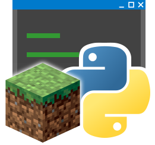

**English** | [中文](README_cn.md)

    

<h1 align="center">MCDReforged</h1>

    A powerful Minecraft server control tool based on Python.

    
    
    
    

    <a href="https://mcdreforged.readthedocs.io/en/latest/">Document</a>
    ·
    <a href="https://github.com/MCDReforged/PluginCatalogue">Plugins</a>
    ·
    <a href="#faq">FAQ</a>
    ·
    <a href="#contact">Contact</a>

## About

MCDReforged (abbreviated as MCDR) is a tool which provides the management ability of the Minecraft server using custom plugin system. It doesn't need to modify or mod the original Minecraft server at all

From in-game calculator, player high-light, to manipulate scoreboard, manage structure file and backup / load backup, you can implement these by using MCDR and related plugins

Great thanks to chino_desu and his [MCDaemon 1.0](https://github.com/kafuuchino-desu/MCDaemon) for the idea of such a cool Minecraft control tool

## Advantage

- It's running above the server. It doesn't need to modify the server at all which keep everything vanilla
- Hot-reloadable plugin system. You don't need to shut down the server to update the plugins
- Multi platform / server compatibility. Supports vanilla, paper, bungeecord etc. on Linux / Windows

## How it works?

MCDR uses [Popen](https://docs.python.org/3/library/subprocess.html#subprocess.Popen) to start the server as a sub-process, then it has the ability to control the standard input / out stream of the server

Since the console output of a Minecraft server has a stable format and contains a large amount of useful information about the server, e.g. player chat messages, MCDR is able to parse and analyze the server output, abstract them into different events and dispatch them towards plugins for responding

With the help of Minecraft command system, MCDR can send Minecraft commands via the standard input stream to affect the actual Minecraft server

That's it, you can even think of MCDR as a robot that stares at the server console and can quickly respond to server output and input related commands if you like 

## FAQ

  
How to install/use MCDR?

  
  > Check the document.

  
Can MCDR be used on the XX server?

  > Check the `handler` section of the documentation first. If MCDR does not yet support the server you are using, feel free to submit an Issue or PR.

  
The plugin doesn't work?

  > First, did the plugin loaded properly? Read the README file of the plugin. Plugin issues are not necessarily related to MCDR itself. Please submit an Issue in the plugin's Github repository first.

  
No plugin I want, junk project

  > Try to make it yourself.

## Contact

Contact me on discord: `Fallen_Breath#1215`

QQ Group: `1101314858`